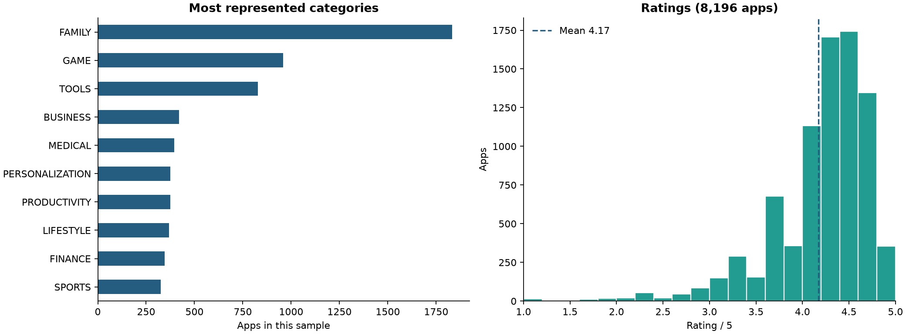
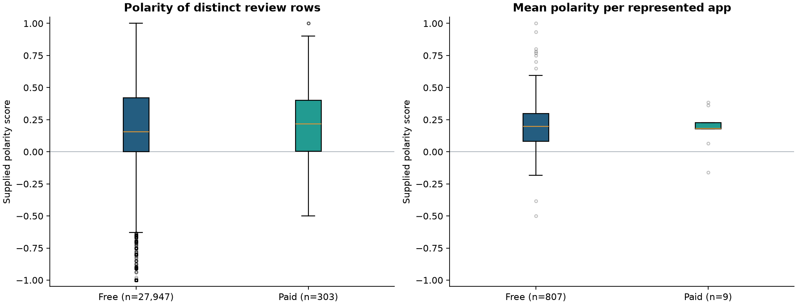

# Google Play Store Analysis

[](https://github.com/1hugemtf/google-play-analysis/actions/workflows/validate.yml)

**9,659 apps. 33 categories. A reproducible exploration of ratings, pricing, install bands and review sentiment.**

[Read the executed notebook](notebook.ipynb) · [Open in Google Colab](https://colab.research.google.com/github/1hugemtf/google-play-analysis/blob/main/notebook.ipynb)



## Questions explored

- Which categories appear most often in this sample?
- How do ratings relate to app size and listed price?
- How do reported install bands differ between free and paid apps?
- Does the free/paid sentiment comparison change when every app receives equal weight?

## Selected findings

| Metric | Result |
|---|---:|
| Apps / categories | 9,659 / 33 |
| Largest category | Family: 1,832 apps |
| Rated apps / mean rating | 8,196 / 4.17 out of 5 |
| Paid apps / median paid price | 756 / $2.99 |
| Median install-band lower bound, free / paid | 100,000 / 1,000 |
| Matched distinct review rows / represented apps | 28,250 / 816 |

The sentiment comparison changes with weighting: mean polarity is **0.188 for free vs. 0.218 for paid** when each distinct review row has equal weight, but **0.199 vs. 0.178** when each app has equal weight. Only **9 paid apps**, compared with 807 free apps, have matched usable reviews. The notebook shows this imbalance instead of claiming that paid apps are better.



## What this project demonstrates

- Explicit numeric parsing of prices and install-band labels.
- Missing-value reporting and analysis-specific filtering.
- A validated many-to-one review join, with unmatched rows counted.
- Exact-duplicate handling and an undeduplicated sensitivity comparison.
- Reproducible, embedded Matplotlib charts that render directly on GitHub.
- Notebook execution and data-integrity assertions in GitHub Actions.

## Data and methods

The two CSV files in `datasets/` are preserved unchanged from the supplied DataCamp project archive, `workspaceGooglePlay.zip`:

- `apps.csv`: 9,659 rows and 14 columns, including a saved index. The analysis drops the index column, checks app-name uniqueness, and retains missing ratings and sizes until the relevant analysis needs them.
- `user_reviews.csv`: 64,295 rows with preprocessed review text and supplied sentiment scores. Of 37,427 usable rows, 7,735 exact duplicates are removed, leaving 29,692 distinct rows. The app join matches 28,250 rows and leaves 1,442 unmatched.

Exact duplicate text does not prove duplicate authorship; review IDs are unavailable. Both deduplicated and undeduplicated results are shown. App-name joins are also limited by the absence of package identifiers.

## Interpretation limits

This historical sample includes app update dates through August 2018; its collection date and sampling design are not established by these files. It is not a current or representative market survey.

- `Installs` contains band lower bounds, not exact download totals.
- Prices are listed dollar amounts, not revenue or willingness to pay.
- Ratings are averaged across rated apps without user-rating weights.
- Size uses MB as described in the source exercise; missing size values are not imputed.
- Supplied sentiment labels are analyzed as given; no sentiment model is trained or validated here.
- High prices are retained and shown on a log axis; price alone is not evidence of a fraudulent app.
- Associations do not establish causation or app quality.
- Some names and review text contain source encoding artifacts; these are preserved rather than guessed.

## Run locally

Use Python 3.12 from the repository root:

```bash
python -m venv .venv
# Activate: Windows PowerShell
.venv\Scripts\Activate.ps1
# Or macOS / Linux
source .venv/bin/activate

python -m pip install -r requirements.txt
python -m jupyterlab notebook.ipynb
```

Run the activation command for your operating system, then use **Restart Kernel and Run All Cells**. The notebook reads only the bundled CSVs and writes four PNG charts into the repository root.

For Colab, first upload both CSV files into a `datasets` folder in the Colab session. Colab is an optional convenience; automated verification uses Python 3.12 with the pinned requirements.

## Validation

```bash
python -m pip check
python validate_notebook.py
```

The validator clears saved outputs, executes every cell, and checks numeric cleaning, expected dataset dimensions, valid ratings and prices, missing-value selection, join cardinality, review totals, polarity bounds and generated charts. It then saves the executed notebook. GitHub Actions runs the same checks on pushes and pull requests and saves the notebook and charts as a downloadable artifact.

## Repository contents

```text
notebook.ipynb                Executed analysis
validate_notebook.py          Re-execution and integrity checks
requirements.txt             Tested package versions
datasets/                    Original source CSV files
categories_and_ratings.png   Category and rating charts
size_and_price.png           Size/price associations
install_bands.png            Free/paid install comparison
review_sentiment.png         Review/app sentiment comparisons
.github/workflows/validate.yml
```

## Attribution

Adapted from the supplied DataCamp Google Play Store project. Analysis, visual presentation and validation have been revised for this portfolio edition. Source-data rights remain with their respective owners; no blanket license is asserted over third-party data.

**Hamed Dhiaa** · [Portfolio](https://1huge-dhiaa.carrd.co) · [LinkedIn](https://www.linkedin.com/in/dhiaa-hamed/)
